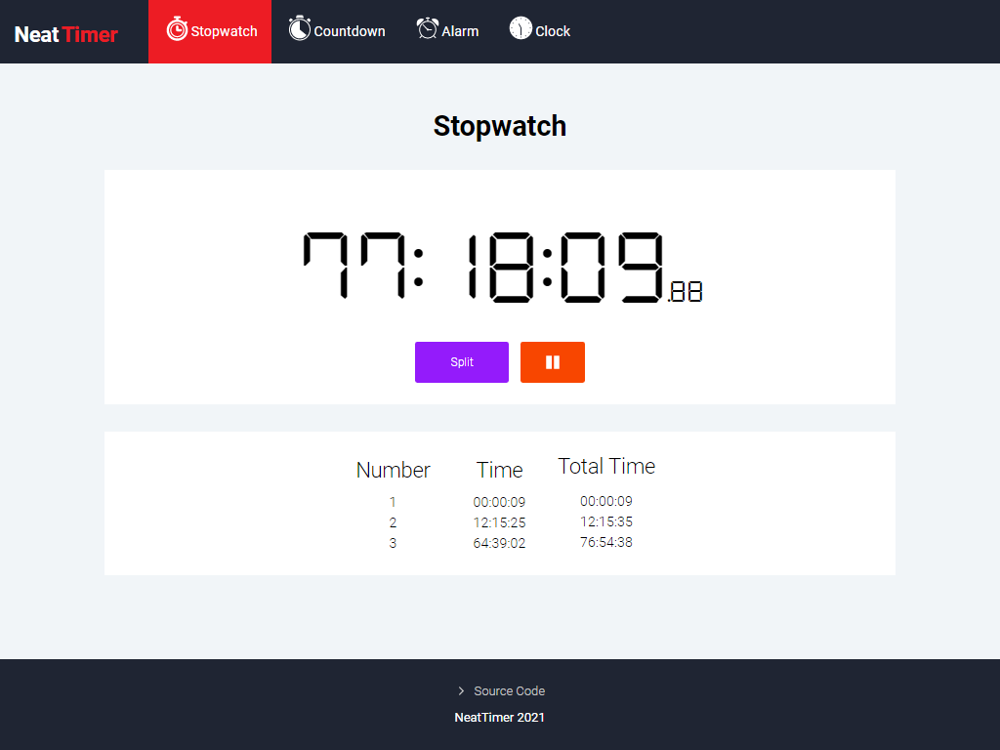

# NeatTimer
>This personal project is a useful timer app that has a stopwatch, a countdown timer, a clock and alarms.

This project was bootstrapped with [Create React App](https://github.com/facebook/create-react-app).

## Live Demo

> This app is available through [this link.](https://neat-timer.herokuapp.com/)

## Built With

- HTML
- CSS
- Javascript ES6
- React, React Hooks, React Icons, React Router and React Helmet
- Browser Notifications
- [World Time API](http://worldtimeapi.org/)
- Heroku
- Audacity
- Freesound.org

## Author

👤 **Carlos Peña**

- Github: [@carlo697](https://github.com/carlo697)
- Linkedin: [Carlos Peña](https://www.linkedin.com/in/carlo697/)